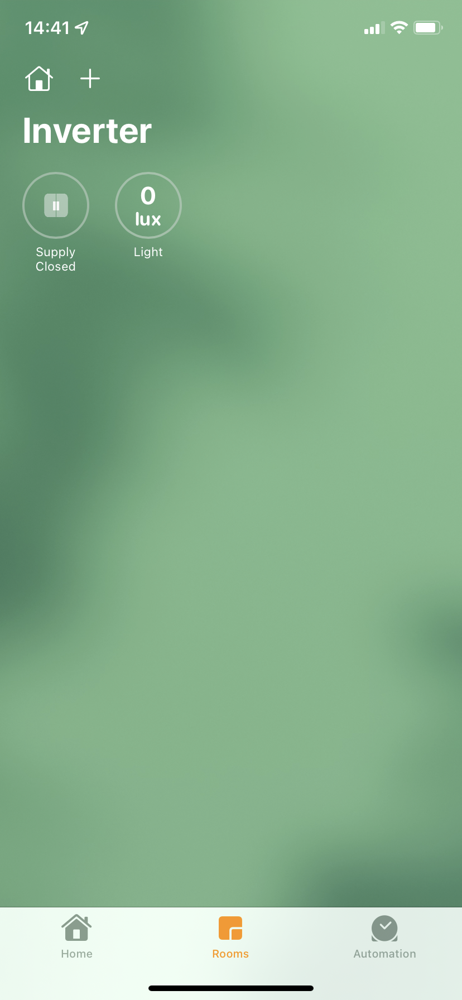
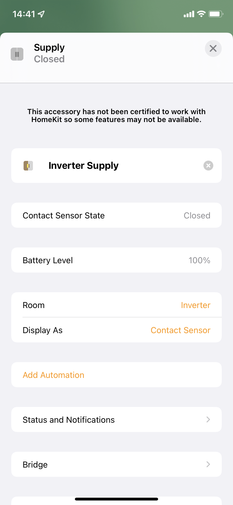
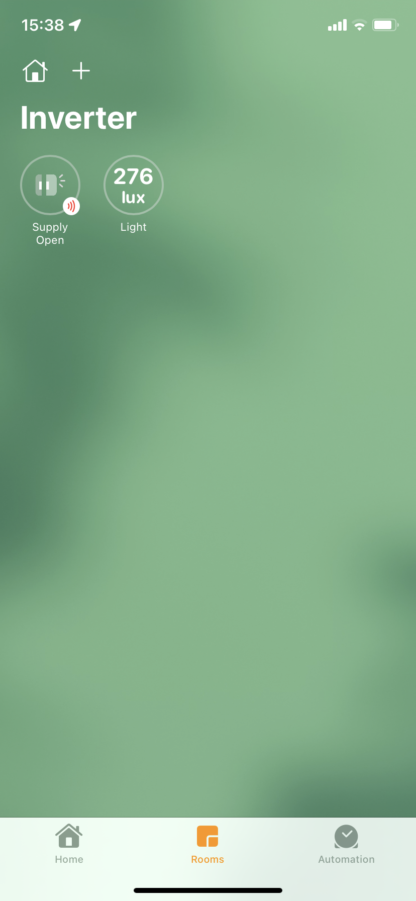
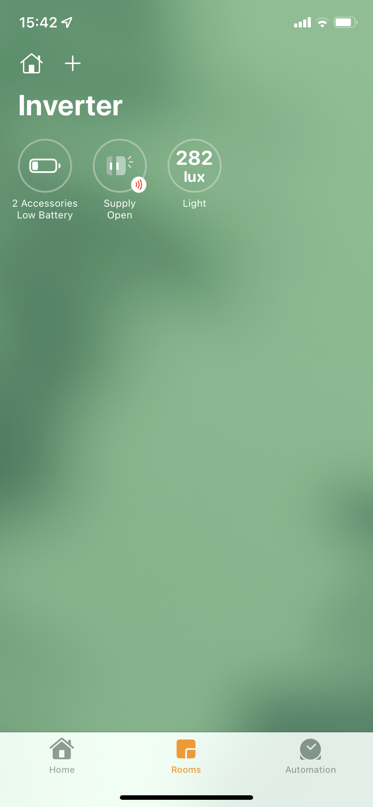

# solarman-mqtt
> Poll Solarman APIs and display data in HomeKit via MQTT broker
> WIP Fork/update to polling solarman APIs after the database split to separate global/chinese regions + API format change
> Implementation currently ongoing. Not ready for use.

# Features
- [x] Display battery power as a light sensor
- [x] Display "Inverter Supply" as a contact sensor (useful for checking if supply is from Inverter or Grid)
- [x] Display battery SOC as a meta property on the contact sensor
- [x] Display low battery alert below a configured threshold
- [x] Display if battery is charging

# Screenshots

# Disclaimer
- This has only been tested on a SofarSolar inverter with a Solarman WiFi data logger.
- See
- The docker images has only been developed with linux/amd64 in mind.
- The original arm docker target has not been tested at all.

# Prerequisites
- docker
- docker-compose
- homebridge
- [homebridge-mqtt plugin](https://github.com/cflurin/homebridge-mqtt)

# Limitations
- The Solarman WiFi loggers only send data every 15 minutes or so (the `POLL_INTERVAL` should be set accordingly)
- Power values (usually watts) are modelled as a light sensor in HomeKit (in Lux). HomeKit does not support any sensor capable of displaying watts.

# Setup
See the example `docker-compose.yml` for details. You will need to contact solarman customer support to be granted API access for the new API.
